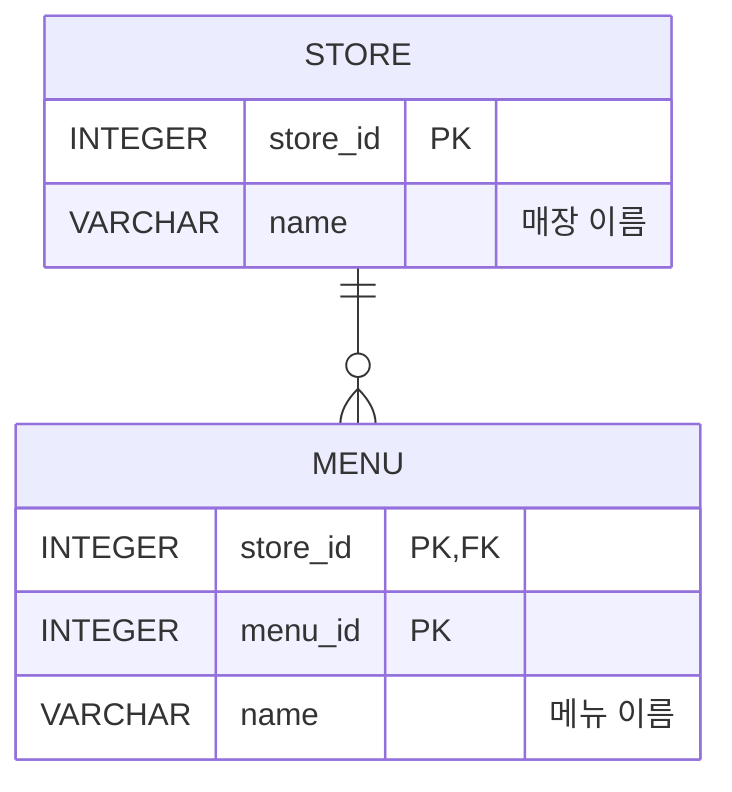

# 세미나 :: ER Diagram 실습

```mermaid
erDiagram
    STORE {
        INTEGER store_id PK
        VARCHAR name "매장 이름"
    }

    MENU {
        INTEGER store_id PK, FK
        INTEGER menu_id PK
        VARCHAR name "메뉴 이름"
    }

    STORE ||--o{ MENU : ""
```