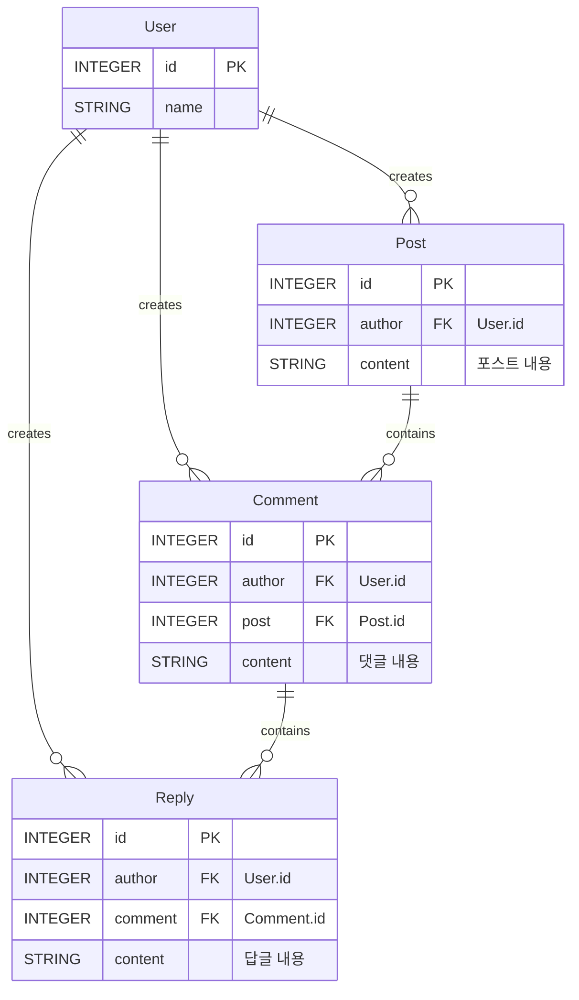

# [과제 #1] 게시판 ERD 모델링하기

## 게시판 데이터 모델링

```mermaid
erDiagram
    User ||--o{ Post : "creates"
    User ||--o{ Comment : "creates"
    User ||--o{ Reply : "creates"

    Post ||--o{ Comment : "contains"
    Comment ||--o{ Reply : "contains"

    User {
        INTEGER id PK
        STRING name
    }

    Post {
        INTEGER id PK
        INTEGER author FK "User.id"
        STRING content "포스트 내용"
    }

    Comment {
        INTEGER id PK
        INTEGER author FK "User.id"
        INTEGER post FK "Post.id"
        STRING content "댓글 내용"
    }

    Reply {
        INTEGER id PK
        INTEGER author FK "User.id"
        INTEGER comment FK "Comment.id"
        STRING content "답글 내용"
    }
```
